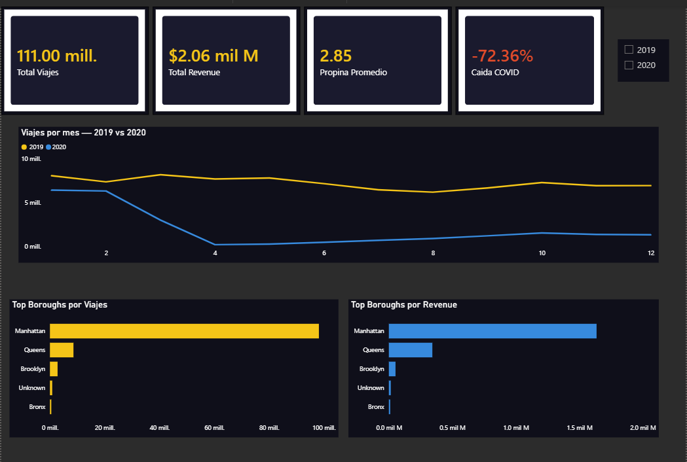
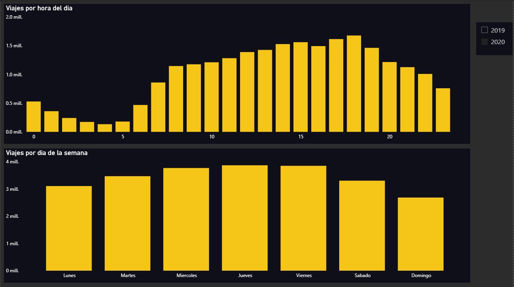
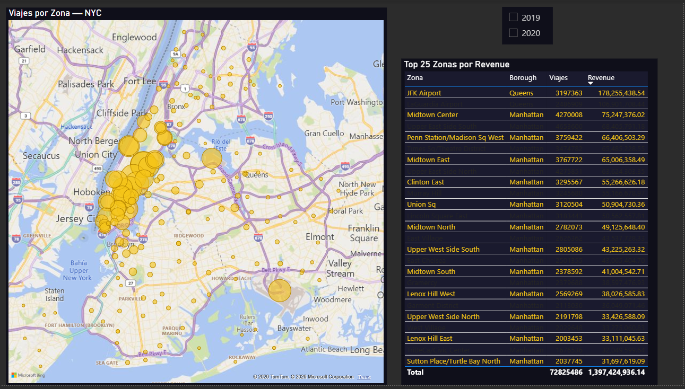
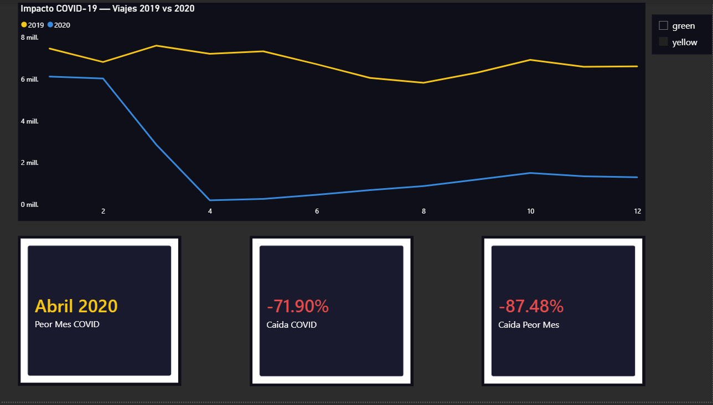
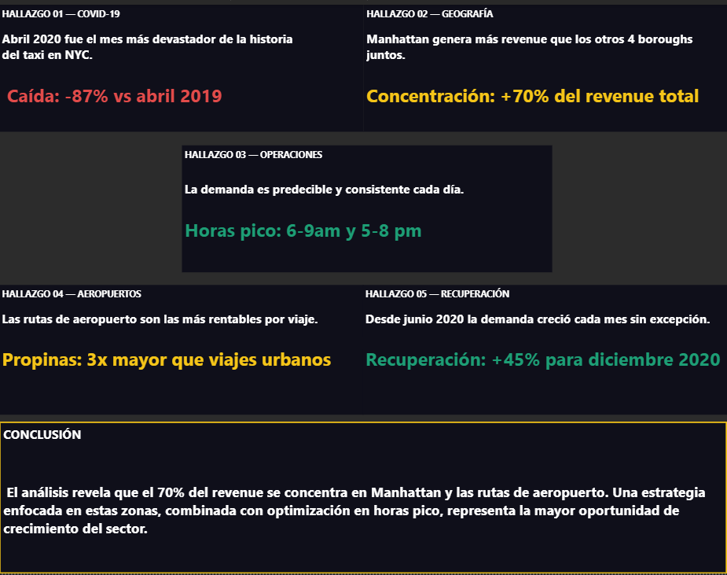

# NYC Taxi — Análisis de Impacto COVID 2019-2020

> Análisis de 110,998,297 viajes reales de taxi en NYC usando Python, MySQL y Power BI. Hallazgo principal: el COVID-19 causó una caída del 87% en la demanda durante abril 2020.

---

## Dashboard

### Resumen Ejecutivo

### Análisis Temporal

### Análisis Geográfico

### Impacto COVID-19

### Hallazgos Clave

---

## Stack Tecnológico

| Herramienta | Uso |
|---|---|
| Python 3.11 | Pipeline ETL, limpieza de datos |
| Pandas / PyArrow | Procesamiento de archivos Parquet |
| MySQL (WSL) | Base de datos |
| SQLAlchemy | Conexión Python-MySQL |
| Power BI Desktop | Dashboard y visualización |

---

## Hallazgos Clave

- Caída del -87% en viajes durante abril 2020 (lockdown COVID-19)
- Más del 70% del revenue total concentrado en Manhattan
- JFK Airport es la zona más rentable por viaje ($178M de revenue)
- La demanda tiene picos consistentes entre 6-9am y 5-8pm de lunes a viernes
- Recuperación gradual desde junio 2020, alcanzando +45% para diciembre 2020

---

## Arquitectura del Proyecto

### Scripts

| Script | Descripción |
|---|---|
| explore.py | Exploración inicial de datos |
| clean_data.py | Limpieza y homologación de datos |
| load_zones.py | Carga de zonas NYC a MySQL |
| load_mysql.py | Carga de 110M viajes a MySQL |
| create_aggregates.py | Creación de tablas agregadas optimizadas |
| test_connection.py | Prueba de conexión MySQL |

---

## Fuente de Datos

Datos oficiales de la NYC Taxi & Limousine Commission (TLC): https://www.nyc.gov/site/tlc/about/tlc-trip-record-data.page

---

## Autor

Cristian Guevara — Portafolio de Análisis de Datos
